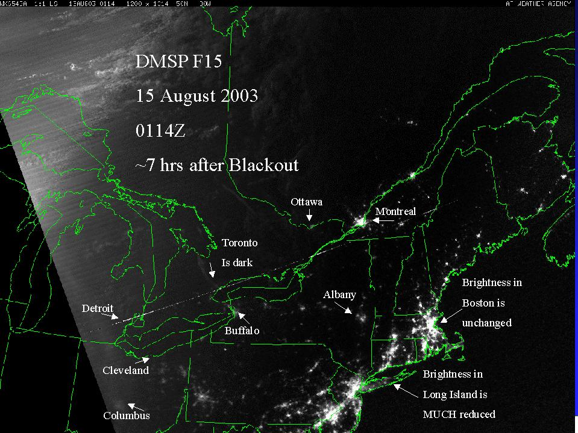

class: middle, center, title-slide
count: false

# ELEC0447 - Analysis of electric power and energy systems

Lecture 1: Introduction and course organization

*Adapted from ELEC0014 introduction by Thierry Van Cutsem*

  

Bertrand Cornélusse 
[bertrand.cornelusse@uliege.be](mailto:bertrand.cornelusse@uliege.be)

---

## Objectives of the lecture

- Show the overall structure of an electric power system
- Highlight a few important features of power system operation
- Illustrate those on the Belgian and European systems
- Present some orders of magnitude it is important to have in mind
- Introduce some terminology

---

## A large scale system

In modern society, electricity has become a “commodity”:

*“marketable good or service whose instances are treated by the market as equivalent with no regard to who produced them”*

- “behind the power outlet” there is a complex industrial process
- electric energy systems are the largest systems ever built by man
 - thousands of km of overhead lines and underground cables, of transformers
 - tens/hundreds of power plants + a myriad of distributed energy sources
 - devices to (dis)connect elements: substations, circuit breakers, isolators
 - protection systems: to eliminate faults
 - real-time measurements : active and reactive power flows, voltage magnitudes, current magnitudes, energy   meters, phasor measurement units
 - controllers: distributed (e.g. in power plant) or centralized (control center)
 - etc.
- unlike most other complex systems built by man, power systems are exposed to external “aggressions” (rain, wind, ice, storm, lightning, etc.)

---

## Low-probability but high-cost failures

In spite of those disturbances, modern electric power systems are very reliable. Assume a duration of power supply interruption of 0.5 hour / year
.center[**availability =** (8760−0.5)/8760= **99.994 %** !]

However, the cost of unserved energy is high
 - average cost used by CREG (Belgian regulator) to estimate the impact of forced load curtailment: 8.3 k€/MWh (source: Bureau fédéral du plan)
 - varies with time of the day : between 6 and 9 k€/MWh
 - varies with type of consumer : 2.3 k€/MWh for domestic, much higher for industrial
 - even higher average cost considered elsewhere (e.g. 26 k€/MWh in France !)

Large-scale failures (blackouts) have tremendous societal consequences
 - next two slides: examples of blackouts and their impacts

---

## USA-Canada blackout, August 2003

.width-45[]
.width-45[]

- 50 million people disconnected initially
- 61 800 MW of load cut in USA & Canada
- cost in USA : 4 to 10 billion US $
- in Canada : 18.9 million working hours lost
- 265 power plants shut down
- restoration : from a few hours to 4 days

.footnote[Source : North American Electric Reliability Council (NERC)]

---

## Italian blackout, September 2003

- Cascade tripping of interconnection lines $\rightarrow$ separation of Italy from rest of UCTE system
.center.width-50[]
- Deficit of 6 660 MW imported in Italian system, causing frequency to collapse in Italy
- 340 power plants shut down, 55 million people disconnected initially - 27 000 MW lost  (blackout occurred during night)
- Estimated cost of disruption  $\approx$ 139 million US $
- Restoration time: 15 hours

.footnote[Source : Union for the Co-ordination of Transmission of Electricity (UCTE) which is now part of ENTSOe]

---

## Network: from early DC ...

End of 19th century : Gramme, Edison devised the first generators, that produced Direct Current (DC) under relatively low voltages

Impossibility to transmit large powers with direct current:
 - $\text{power} = \text{voltage}\times \text{current}$
  - if the voltage cannot be increased, the current must be
  - but  $\text{power lost} = \text{resistance} \times \text{current}^2$        $\rightarrow$  big waste of  energy
  - and large sections of conductors required               $\rightarrow$  expensive and heavy
 - impossible to interrupt a large DC current (no zero crossing), for instance after a short-circuit

---
## Network: ... to present high-voltage AC
Changing for Alternating Current (AC)
 - voltage increased and lowered thanks to the transformer
 - standardized values of frequency : 50 and 60 Hz (other values used at a few places)

Larger nominal voltages have been used progressively
 - up to 400 kV in Western Europe
 - up to 765 kV in North America
 - experimental lines at 1100 kV or 1200 kV (Kazakhstan, Japan, etc.)

---

## Structure of electric network  (case of Belgium)

**TODO insert fig of VCT**

.footnote[In Belgium there are 30 and 36 kV underground cable networks, in Brussels and Antwerp areas. These are meshed and play the role of sub-transmission.]

---

# References

Main reference book:
- Mohan, Ned. Electric power systems: a first course. John Wiley & Sons, 2012.

Other references: 
- Course notes of ELEC0014 by Pr. Thierry Van Cutsem. (In french)
- Weedy, Birron Mathew, et al. Electric power systems. John Wiley & Sons, 2012.

---

class: end-slide, center
count: false

The end.
