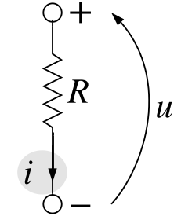
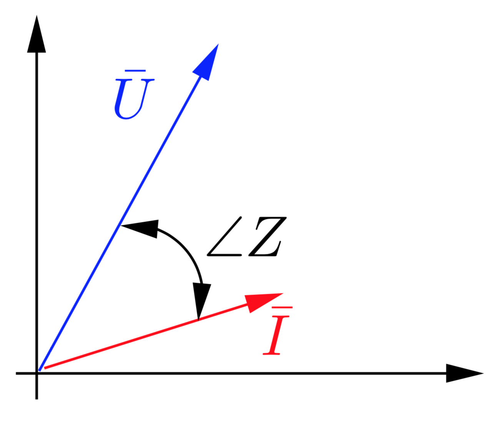
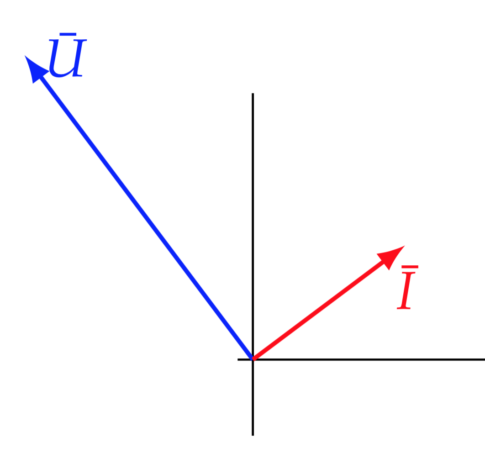
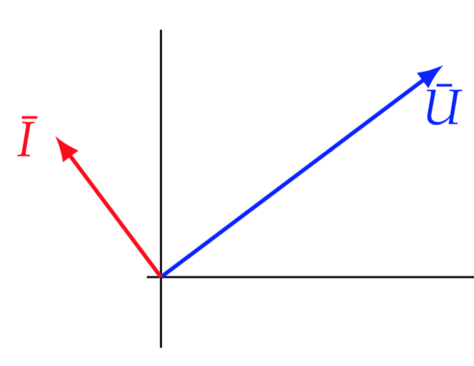
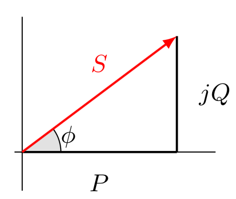
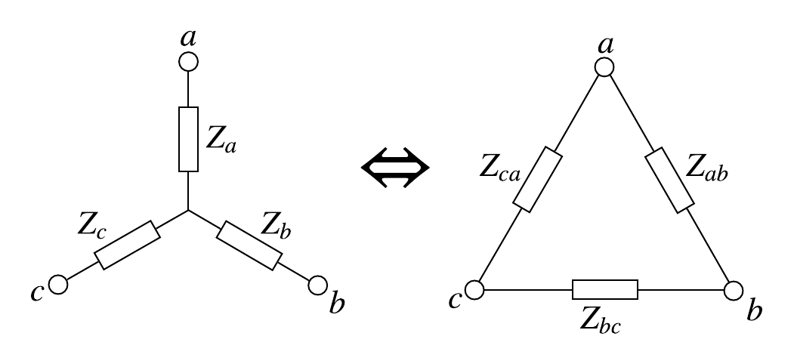

class: middle, center, title-slide
count: false

# Analysis of electric power and energy systems

Lecture 2: Three-phase systems in sinusoidal steady state

  

Bertrand Cornélusse 
[bertrand.cornelusse@uliege.be](mailto:bertrand.cornelusse@uliege.be)

---

# What will we learn today?

- Recap of conventions
- Sinusoidal steady state analysis
- 3-phase systems
- Per unit normalization

You will be able to do exercises 2.1, 2.2, 2.4, 2.5, 2.9, 2.11, 2.12, 2.14, 2.16, 2.17, 2.18, 2.19 and 2.20 from the Ned Mohan's book.

---

class: middle

# Basics and conventions

---

## Power and energy

 - Power measures the rate of use of energy
 - It is expressed in Watt [W]: 1 W = 1 Joule/second
 - In an electric system, $$p(t) = u(t) \times i(t)$$
  - $u(t)$ is the voltage measured in volt [V], the line integral of the electric field between two points.
  - $i(t)$ is the current measured in amps [A]
  - $t$ is the time 
 - To measure energy in power systems, we use units ranging from a kWh (a microgrid) to a TWh (a country)
 - Devices have power ratings ranging from W to GW (although we generally speak in VA for ratings)

---

class: middle, center, black-slide

<iframe width="600" height="450" src="https://www.youtube.com/embed/S4O5voOCqAQ" frameborder="0" allowfullscreen></iframe>

The cyclist vs the toaster.

---

## Motor convention (or standard reference)

When using the motor convention to direct $u$ w.r.t. $i$, $p(t)$ represents the power **consumed** by a device (here a resistor): 

.center[.width-20[]]

 - The power consumed can be < 0, = 0, or > 0 depending on the device
 - E.g. for a resistor we always have $p(t) \geq 0$
 - The **opposite** convention is the **generator convention**
 - We will sometimes use a mix of both conventions, based on intuition, so that in general we have few negative numbers: pay attention to the orientations! 

---

## Magnetic fields, etc.

Magnetic fields have a central role to model the behavior of equipment (lines, transformers, generators, etc.).

As this course will not be focused on modeling devices, but rather a system of devices, magnetic effects will often be highly abstracted (an inductance, or a turns ratio).

Let's just recall that 
- a magnetic field is due to charges in movement or magnetized materials
- it is measured in amps/meter (for $H$) or in Tesla (for $B$) when we capture the effect of the material (the $\mu\_0$ coefficient in the air)
- the magnetic flux ($\phi$ in weber) measures the magnetic field crossing a surface
- a time varying magnetic flux induces a voltage (Lenz), this is the fundamental principle behind transformers.

---

class: middle

# Sinusoidal steady state analysis

---

## Sinusoidal signals and phasor representation

Unless otherwise specified, we will always work with sinusoidal signals and in steady state:
$$y(t)= \sqrt{2} Y \cos(\omega t + \phi\_y).$$

$Y$ is the *rms* value of the signal, $\phi\_y$ its phase and $\omega$ its angular frequency.

At a specific frequency $f = \frac{\omega}{2\pi}$, the signal can be represented as a phasor
$$\bar{Y} = Y \angle \phi_y = Y e^{j \phi_y}$$

Phasors allow to work in the frequency domain, which is much more handy for computations.

*How do you get the time expression from the phasor?*

---

class: middle, center

.center[]
https://en.wikipedia.org/wiki/Phasor

---

## Impedance

Let $u(t)$ and $i(t)$ be the voltage and current across a one-port, respectively, in sinusoidal steady state and with the motor convention.

 - For a resistor, $u(t) = R i(t)$ hence $\bar{U} = R \bar{I}$
 - For a self, $u(t) = L \frac{di(t)}{dt}$ hence $\bar{U} = j\omega L \bar{I}$
 - For a capacitor, $i(t) = C \frac{du(t)}{dt}$ hence $\bar{I} = j\omega C \bar{U}$

The *impedance*, a complex number, generalizes this notion
$$Z = R + jX \ \ [\Omega]$$ 
such that $\bar{U} = Z \bar{I}$ with 

 - for a resistor, $Z = R$
 - for a self, $Z = jX = j\omega L$
 - for a capacitor, $Z = jX = -j\frac{1}{\omega C}$

---

## Impedance, admittance, etc.

The imaginary part of the impedance, $X$, is called reactance

The admittance $Y$ is the inverse of the impedance, expressed in Siemens:

$$Y = G + jB$$

- $G$ is the conductance
- $B$ is the susceptance

---

class: middle, center, black-slide

<iframe width="600" height="450" src="https://www.youtube.com/embed/zO7RZZW0wSQ" frameborder="0"  allowfullscreen></iframe>

A nice animation.

---

## Complex calculus

$$|Z| = \sqrt{R^2+X^2}$$
$$\angle Z = \arctan \frac{X}{R}$$
$$Z = \frac{\bar{U}}{\bar{I}} = \frac{{U}}{{I}} \angle (\phi\_u - \phi_i)$$

---

## Phasor diagrams

Plot the phasors in the complex plane!

.center.width-50[]

Inductive or capacitive? Which is which?
.grid[
.kol-1-2[.center.width-40[]]
.kol-1-2[.center.width-50[]]]

---

## The notions of power

The complex power is defined as $$S = \bar{U}\bar{I}^*$$

Let $$\phi = \phi_u - \phi_i$$
then $$S = UI e^{j\phi} = P + jQ$$

- $P = UI \cos\phi$ is the active power, measured in watt
- $Q = UI \sin\phi$ is the reactive power, measured in var
- $\cos\phi$ is the power factor

Reactive power is, in general, undesirable. 

The apparent power is $|S| = UI$, measured in VA

---

## Useful formulas

$$P = RI^2 = \frac{U^2}{R}$$
$$Q = XI^2 = \frac{U^2}{X}$$
$$\tan \phi = \frac{Q}{P}$$
$$\cos \phi = \frac{P}{|S|}$$

The power factor does not tell you whether the system is leading or lagging
 - in an inductive system, $u(t)$ precedes $i(t)$, $i(t)$ is lagging, thus $Q > 0$ (motor convention)
 - in a capacitive system, this is the opposite (leading).

---

## Power factor compensation

.width-40[]

Produce some $Q$ to cancel out $\phi$.

*Exemple:* 

A 120V voltage source at 60 Hz that feeds a R-L load $1858.4 + j 1031.4 \ VA $

---

## Power transfer between AC systems
.grid[
.kol-1-2[Consider the following simple system   
We have $\bar{I} = \frac{\bar{V}\_s-\bar{V}\_r}{jX}$]
.kol-1-2[
.center.width-100[]]]

Let $\delta$ be the angle between $\bar{V}\_r$ and $\bar{V}\_s$, then 
$$\begin{aligned}
S\_r &= \bar{V}\_r\bar{I}^*  = V\_r \left(\frac{V\_s \angle -\delta - V\_r}{-jX}\right) \\\\
     &= \frac{V\_s V\_r \sin \delta }{X} +j \frac{V\_s V\_r \cos \delta - V^2\_r}{X} 
\end{aligned}$$

**Let's remember two things:**

 - The **active** power is highly sensitive to **$\delta$**
 - The **reactive** power acts on the **voltage magnitude** (look at what happens for $\delta=0$)

---

class: middle
# Three-phase systems

---

## Three-phase system

.width-100[]

.center[Generation -> transmission -> load]

Here the load is connected as a *star*. A neutral point is present.

The neutral conductor is not necessarily implemented. 

---

By design the voltage sources are shifted by 120°: 

$$\begin{aligned}
\bar{V}\_{ga} &= V e^{j\phi\_u} \\\\
\bar{V}\_{gb} &= V e^{j(\phi\_u - 2 \pi / 3)} = \bar{V}\_{ga} e^{-j 2 \pi / 3} \\\\
\bar{V}\_{gc} &= V e^{j(\phi\_u - 4 \pi / 3)} = \bar{V}\_{ga} e^{-j 4 \pi / 3}
\end{aligned}$$

These voltages represent the **phase voltages**. If we now look at the **line to line voltages**: 

$$\bar{U}\_{ab} = \bar{V}\_{ga} - \bar{V}\_{gb} = \sqrt{3} \bar{V}\_{ga} e^{j\pi / 6}$$
and similarly for $\bar{U}\_{bc}$ and $\bar{U}\_{ca}$.

The total complex power transmitted to the load is 
$$S = \sum\_{k \in \\{a, b, c\\}} \bar{V}\_{gk} \bar{I}^*\_{k} $$

Hence in a balanced system the total active power to the load is $3VI \cos \phi$, with 3 or 4 wires (instead of 2 in a single-phase system).

---

.center.width-half[]
.center[Line vs. phase voltages]

*Example:*

My house is fed by a 400V three-phase system. This means the line voltages are 400V (rms), and thus phase voltages are 230V (approximately). Typically, the phase voltages are distributed independently in the house, each with the neutral.

---
## Comments

In every phase there is a current flowing. In a balanced system, currents are phase shifted by 120° and sum to zero. Thus the neutral can in theory be removed. This is done in some portions of the global system (typically at high voltage), where neutral points are grounded.

Some loads can also be connected in "delta", hence the neutral is not accessible. 

Finally, in unbalanced systems currents are dictated by the impedances seen in the different phases and have no perfectly known relation among them.

---

class: middle, center, black-slide

<iframe width="600" height="450" src="https://www.youtube.com/embed/HqZtptHnC2I" frameborder="0" allowfullscreen></iframe>

Why not 6 or 12?

---

## Useful formulas: from star to delta connection (and back)

.center.width-60[]

.grid[
.kol-1-2[$$ \begin{aligned}
Z\_a &= \frac{Z\_{ab}Z\_{ca}}{Z\_{ab} + Z\_{bc} + Z\_{ca}} \\\\
Z\_b &= \frac{Z\_{bc}Z\_{ab}}{Z\_{ab} + Z\_{bc} + Z\_{ca}} \\\\
Z\_c &= \frac{Z\_{ca}Z\_{bc}}{Z\_{ab} + Z\_{bc} + Z\_{ca}}
\end{aligned}$$]
.kol-1-2[$$ \begin{aligned}
Z\_{ab} &= \frac{Z\_{a}Z\_{b}+Z\_{b}Z\_{c}+Z\_{c}Z\_{a}}{Z\_{c}} \\\\
Z\_{bc} &= \frac{Z\_{a}Z\_{b}+Z\_{b}Z\_{c}+Z\_{c}Z\_{a}}{Z\_{a}} \\\\
Z\_{ca} &= \frac{Z\_{a}Z\_{b}+Z\_{b}Z\_{c}+Z\_{c}Z\_{a}}{Z\_{b}}
\end{aligned}$$]
]

What happens in a balanced system?

---

## Per-phase analysis

In a **balanced** system, analyses can be simplified by reprensenting only one phase

 - this is straighforward if there are no couplings between phases
 .center.width-80[]
 - in case there is a coupling, and that for instance the voltage drop $\bar{V}\_{aA}$ along a line presenting an impedance $Z\_{self}$ traversed by a current $\bar{I}\_{a}$ is also function of the currents in the other phases:
$$\bar{V}\_{aA} = Z\_{self} \bar{I}\_{a} + Z\_{mutual} \bar{I}\_{b} + Z\_{mutual} \bar{I}\_{c}$$
then the per-phase equivalent impedance (for phase $a$) is $$Z\_{aA} = Z\_{self} - Z\_{mutual}$$
since $\bar{I}\_{a} + \bar{I}\_{b} + \bar{I}\_{c} = 0$

---

## One-line diagram

.center.width-80[]

---

class: middle
# The "per unit" representation

---

## The per unit representation is a way to normalize data

It is used extensively in power systems. 
It has several advantages:

 - Values (e.g. device parameters) stay in a narrow range (whatever their "size")
 - Voltages tend to have values close to 1, which eases comparison
 - With appropriate "normalization ratios", (ideal) transformers disappear
 - Normalization facilitates numerical computation (no huge numbers, no tiny numbers)

---

## Working in per unit in 5 steps

 1. Chose 3* "fundamental" base values: 
  - $V_B$ for the voltage [kV]
  - $S_B$ for the power [MVA]
  - $t_B$ for the time [s], or $\omega_B$ for the angular frequency [rad/s]
 2. Derive other needed base values from physical laws, e.g. 
  - the base current: $I_B = S_B/V_B$ [A]
  - the base impedance: $Z_B = V_B^2/S_B$ [$\Omega$]
 3. Normalize input data: divide parameters by their base value
 4. Make your computations
 5. (If necessary) Apply the inverse transformation

--

Data in per unit is by definition dimensionless; pay attention to base value units w.r.t. to physical value units!

(*) When there are transformers, one base voltage per voltage level is preferrable

---

## Example 

It is known that the internal reactance of a synchronous machine lies typically in the range $[1.5, 2.5] \ pu$ (on the machine base)

- A machine with the characteristics $(20 \ kV, 300 \ MVA)$ has a reactance of $2.667 \ \Omega$. Is this a normal value?
 - (Here we do not need a base value for time)
 - the base impedance is $Z_B = 20^2/300 = 1.333 \ \Omega$
 - hence the value of the reactance in per unit is $2.667/1.333 = 2 \ pu$
 - this is a quite normal value!
- Same question for a machine with the characteristics $(15 \ kV, 30 \ MVA)$
 - The base impedance is now $Z_B=15^2/30 = 7.5 \ \Omega$
 - the value of the reactance in per unit is $2.667/7.5 = 0.356 \ pu$
 - hence an abnormal small value!

.footnote[From ELEC0014]

---

## Per unit in three-phase systems

Let the base power $S\_B$ be the three-phase power, and $U\_b=\sqrt{3}V\_B$ be the line to line voltage base.

The (single-phase) base current is $$I\_B = \frac{S\_B}{3V\_B} = \frac{S\_B}{\sqrt{3}U\_B}$$

The base impedance is $$Z\_B = \frac{V\_B}{I\_B} = \frac{3V^2\_B}{S\_B} = \frac{U\_B^2}{S\_B}$$

In a single phase equivalent representation, the power values in per unit can be multiplied by $S\_b$ to get the total three-phase power.

---

# References

- Mohan, Ned. Electric power systems: a first course. John Wiley & Sons, 2012.
- Course notes of ELEC0014 by Pr. Thierry Van Cutsem.

---

class: end-slide, center
count: false

The end.
