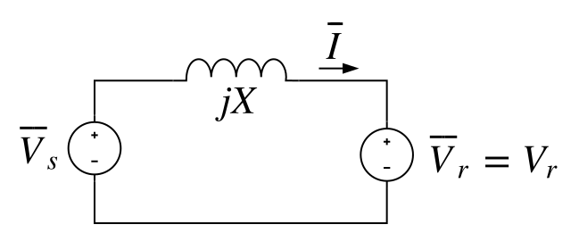
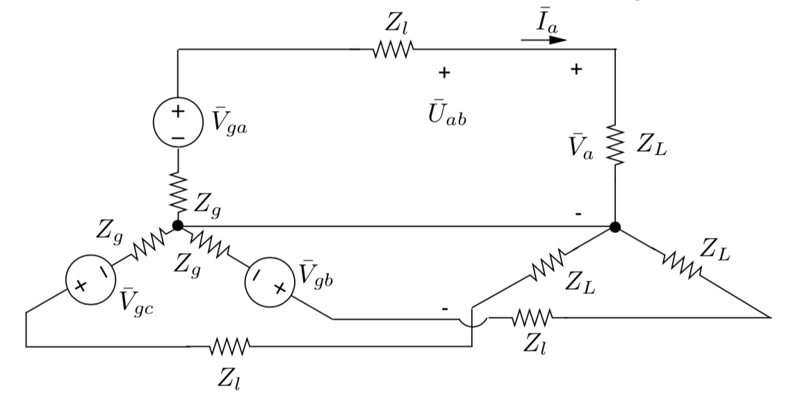
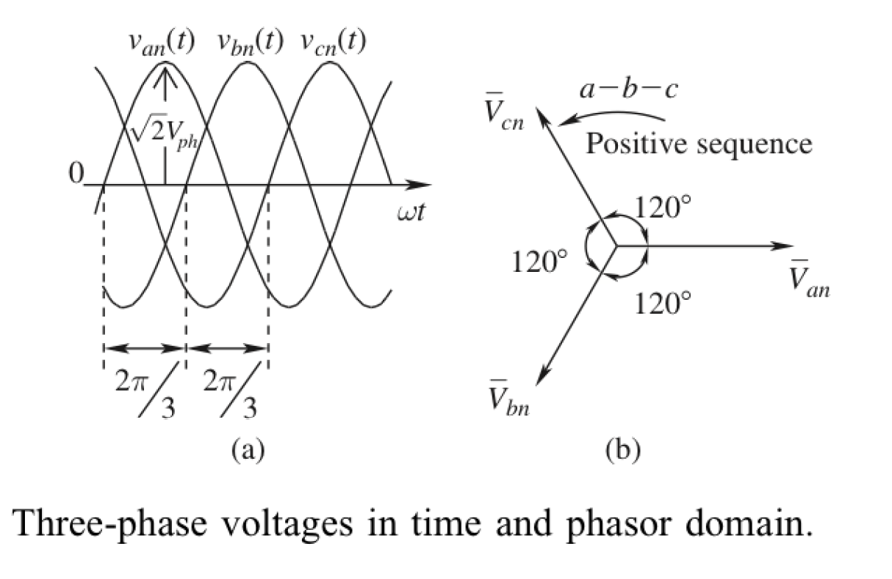
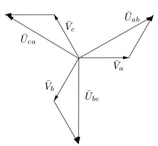
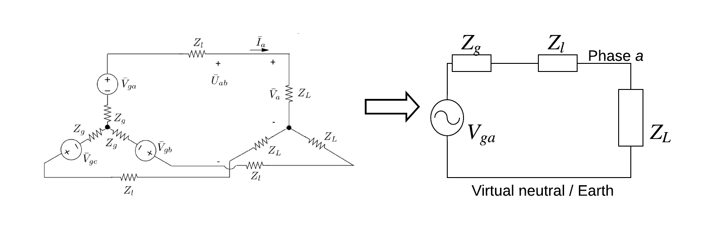

class: middle, center, title-slide
count: false

# Analysis of electric power and energy systems

Three-phase systems in sinusoidal steady state, per-unit analysis

  

Bertrand Cornélusse 
[bertrand.cornelusse@uliege.be](mailto:bertrand.cornelusse@uliege.be)

---

# What will we learn today?

- Power transfer between AC systems
- 3-phase systems
- Per unit normalization

You will be able to do exercises 2.1, 2.2, 2.4, 2.5, 2.9, 2.11, 2.12, 2.14, 2.16, 2.17, 2.18, 2.19 and 2.20 from the Ned Mohan's book.

---

## Power transfer between AC systems

.grid[
.kol-1-2[Consider the following simple system   
We have $\bar{I} = \frac{\bar{V}\_s-\bar{V}\_r}{jX}$]
.kol-1-2[
.center.width-100[]]]

Let $\delta$ be the angle between $\bar{V}\_r$ and $\bar{V}\_s$, then 
$$\begin{aligned}
S\_r &= \bar{V}\_r\bar{I}^*  = V\_r \left(\frac{V\_s \angle -\delta - V\_r}{-jX}\right) \\\\
     &= \frac{V\_s V\_r \sin \delta }{X} +j \frac{V\_s V\_r \cos \delta - V^2\_r}{X} 
\end{aligned}$$

**Let's remember two things:**

 - The **active** power is highly sensitive to **$\delta$**
 - The **reactive** power acts on the **voltage magnitude** (look at what happens for $\delta=0$)

---

class: middle

# Three-phase systems

---

## Three-phase system

.width-100[]

.center[Generation -> transmission -> load]

Here the load is connected as a *star*. A neutral point is present.

The neutral conductor is not necessarily implemented. 

---

By design the voltage sources are shifted by 120°: 

$$\begin{aligned}
\bar{V}\_{ga} &= V e^{j\phi\_u} \\\\
\bar{V}\_{gb} &= V e^{j(\phi\_u - 2 \pi / 3)} = \bar{V}\_{ga} e^{-j 2 \pi / 3} \\\\
\bar{V}\_{gc} &= V e^{j(\phi\_u - 4 \pi / 3)} = \bar{V}\_{ga} e^{-j 4 \pi / 3}
\end{aligned}$$

.center.width-70[]

---

## Phase voltage vs line to line voltage

These voltages represent the **phase voltages**. If we now look at the **line to line voltages**: 

$$\bar{U}\_{ab} = \bar{V}\_{ga} - \bar{V}\_{gb} = \sqrt{3} \bar{V}\_{ga} e^{j\pi / 6}$$
and similarly for $\bar{U}\_{bc}$ and $\bar{U}\_{ca}$.

---

## Total power

The total complex power transmitted to the load is 
$$S = \sum\_{k \in \\{a, b, c\\}} \bar{V}\_{gk} \bar{I}^*\_{k} $$

Hence in a balanced system the total active power to the load is $3VI \cos \phi$, with 3 or 4 wires (instead of 2 in a single-phase system).

---

.center.width-half[]
.center[Line vs. phase voltages]

*Example:*

My house is fed by a 400V three-phase system. This means the line voltages are 400V (rms), and thus phase voltages are 230V (approximately). Typically, the phase voltages are distributed independently in the house, each with the neutral.

---
## Comments

In every phase there is a current flowing. In a balanced system, currents are phase shifted by 120° and sum to zero. Thus the neutral can in theory be removed. This is done in some portions of the global system (typically at high voltage), where neutral points are grounded.

Some loads can also be connected in "delta", hence the neutral is not accessible. 

Finally, in unbalanced systems, currents are dictated by the impedances seen in the different phases. There is no perfectly known relation, a priori.

---

class: middle, center, black-slide

<iframe width="600" height="450" src="https://www.youtube.com/embed/HqZtptHnC2I" frameborder="0" allowfullscreen></iframe>

Why not 6 or 12?

---

## Useful formulas: from star to delta connection (and back)

.center.width-60[]

.grid[
.kol-1-2[$$ \begin{aligned}
Z\_a &= \frac{Z\_{ab}Z\_{ca}}{Z\_{ab} + Z\_{bc} + Z\_{ca}} \\\\
Z\_b &= \frac{Z\_{bc}Z\_{ab}}{Z\_{ab} + Z\_{bc} + Z\_{ca}} \\\\
Z\_c &= \frac{Z\_{ca}Z\_{bc}}{Z\_{ab} + Z\_{bc} + Z\_{ca}}
\end{aligned}$$]
.kol-1-2[$$ \begin{aligned}
Z\_{ab} &= \frac{Z\_{a}Z\_{b}+Z\_{b}Z\_{c}+Z\_{c}Z\_{a}}{Z\_{c}} \\\\
Z\_{bc} &= \frac{Z\_{a}Z\_{b}+Z\_{b}Z\_{c}+Z\_{c}Z\_{a}}{Z\_{a}} \\\\
Z\_{ca} &= \frac{Z\_{a}Z\_{b}+Z\_{b}Z\_{c}+Z\_{c}Z\_{a}}{Z\_{b}}
\end{aligned}$$]
]

What happens in a balanced system?

---

## Per-phase analysis

In a **balanced** system, analyses can be simplified by reprensenting only one phase

 - this is straighforward if there are no couplings between phases
 .center.width-80[]
 - in case there is a coupling, and that for instance the voltage drop $\bar{V}\_{aA}$ along a line presenting an impedance $Z\_{self}$ traversed by a current $\bar{I}\_{a}$ is also function of the currents in the other phases:
$$\bar{V}\_{aA} = Z\_{self} \bar{I}\_{a} + Z\_{mutual} \bar{I}\_{b} + Z\_{mutual} \bar{I}\_{c}$$
then the per-phase equivalent impedance (for phase $a$) is $$Z\_{aA} = Z\_{self} - Z\_{mutual}$$
since $\bar{I}\_{a} + \bar{I}\_{b} + \bar{I}\_{c} = 0$

---

## One-line diagram

.center.width-80[]

---

class: middle
# The "per unit" representation

---

## The per unit representation is a way to normalize data

It is used extensively in power systems. 
It has several advantages:

 - Values (e.g. device parameters) stay in a narrow range (whatever their "size")
 - Voltages tend to have values close to 1, which eases comparison
 - With appropriate "normalization ratios", (ideal) transformers disappear
 - Normalization facilitates numerical computation (no huge numbers, no tiny numbers)

---

## Working in per unit in 5 steps

 1. Chose 3* "fundamental" base values: 
  - $V_B$ for the voltage [kV]
  - $S_B$ for the power [MVA]
  - $t_B$ for the time [s], or $\omega_B$ for the angular frequency [rad/s]
 2. Derive other needed base values from physical laws, e.g. 
  - the base current: $I_B = S_B/V_B$ [A]
  - the base impedance: $Z_B = V_B^2/S_B$ [$\Omega$]
 3. Normalize input data: divide parameters by their base value
 4. Make your computations
 5. (If necessary) Apply the inverse transformation

--

Data in per unit is by definition dimensionless; pay attention to base value units w.r.t. to physical value units!

(*) When there are transformers, one base voltage per voltage level is preferrable

---

## Example 

It is known that the internal reactance of a synchronous machine lies typically in the range $[1.5, 2.5] \ pu$ (on the machine base)

- A machine with the characteristics $(20 \ kV, 300 \ MVA)$ has a reactance of $2.667 \ \Omega$. Is this a normal value?
 - (Here we do not need a base value for time)
 - the base impedance is $Z_B = 20^2/300 = 1.333 \ \Omega$
 - hence the value of the reactance in per unit is $2.667/1.333 = 2 \ pu$
 - this is a quite normal value!
- Same question for a machine with the characteristics $(15 \ kV, 30 \ MVA)$
 - The base impedance is now $Z_B=15^2/30 = 7.5 \ \Omega$
 - the value of the reactance in per unit is $2.667/7.5 = 0.356 \ pu$
 - hence an abnormal small value!

.footnote[From ELEC0014]

---

## Per unit in three-phase systems

Let the base power $S\_B$ be the three-phase power, and $U\_b=\sqrt{3}V\_B$ be the line to line voltage base.

The (single-phase) base current is $$I\_B = \frac{S\_B}{3V\_B} = \frac{S\_B}{\sqrt{3}U\_B}$$

The base impedance is $$Z\_B = \frac{V\_B}{I\_B} = \frac{3V^2\_B}{S\_B} = \frac{U\_B^2}{S\_B}$$

In a single phase equivalent representation, the power values in per unit can be multiplied by $S\_b$ to get the total three-phase power.

---

# References

- Mohan, Ned. Electric power systems: a first course. John Wiley & Sons, 2012.
- Course notes of ELEC0014 by Pr. Thierry Van Cutsem.

---

class: end-slide, center
count: false

The end.
