class: middle, center, title-slide
count: false

# Analysis of electric power and energy systems

Lecture 6: High Voltage DC transmission

  

Bertrand Cornélusse 
[bertrand.cornelusse@uliege.be](mailto:bertrand.cornelusse@uliege.be)

---

# What will we learn today?

- Why HVDC systems are used and how they are implemented (focus on LCC)
- What are LCCs
- What are thyristors
- Basic control principles of LCC HVDC
- How to insert a point-to-point HVDC line in a power flow analysis

You will be able to do exercises *TODO*.

Note that I have mainly taken material from former course "ELEC0445 - HVDC grids", but it follows the logic of Chapter 7 of Ned Mohan's book.

---

class: middle, center

# Overview of HVDC applications

Introduction of former course "ELEC0445 - HVDC grids".

---

## Principle of HVDC links

-   HVDC links embedded in AC systems

-   Rely on converters :

    -   rectifier: from AC to DC

    -   inverter: from DC to AC

.center.width-80[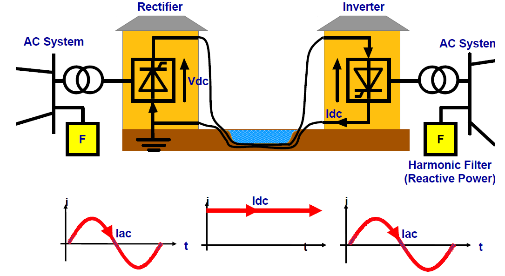]

---

## Historical perspective

-   At the beginning (end of 19th century) : two struggling parties

    -   first generators producing Direct Current (DC) - Gramme, Edison

    -   first generators producing Alternating Current (AC) - Ferranti,
        Tesla

-   Have a look at the video ["War of the currents"](https://www.youtube.com/watch?v=dIfIRj0Crc8)

-   the AC system won :

    -   possibility to increase and lower the voltage thanks to the
        transformer $\Rightarrow$ transmission of higher powers possible

    -   creation of a rotating field easy with three-phase AC windings

    -   Difficulty to raise the DC voltage $\Rightarrow$
        impossibility to transmit large powers with DC

    -   limitation of the power of early converters : a few kW only

    -   difficulty of interrupting a DC current.

-   Revival of DC technology in the ‘50s

---

## Historical perspective (cont’d)

-   Advances in power electronics : converters can carry larger currents
    through higher voltages $\Rightarrow$ higher power ratings
    $\Rightarrow$ transmission applications possible
-   1882 : Marcel Deprez (France) and Oskar Von Miller (Germany, AEG)
    design the first transmission link between a DC source and a DC
    load:
    $15 \,\text{kW} ~~ 2\, \text{kV} ~~ 56.3\, \text{km}$
- See also René Thury's work: https://en.wikipedia.org/wiki/Ren%C3%A9_Thury
-   mid ‘30s : mercury-arc valve rectifiers made available.
    They open the way to HVDC transmission link projects
-   1945 : first commercial project of HVDC transmission in Germany.
    Not commissioned and moved to USSR (Moscow-Kashira) in 1950:
    $60\,\text{MW} ~~ 200\, \text{kV} ~~ 115 \, \text{km}$, with buried
    cables
    - Nekrasov, A. M., & Posse, A. V. (1959). Work done in the Soviet Union on high-voltage long-distance dc power transmission. Transactions of the American Institute of Electrical Engineers. Part III: Power Apparatus and Systems, 78(3), 515-521.
-   1954 : first commercial HVDC submarine installation : from Gotland
    island to Sweden:
    $20 \,\text{MW} ~~ 100\, \text{kV} ~~ 98 \, \text{km}$
-   Up to the mid ‘60s, due to its higher cost, HVDC was favoured only
    where AC met operational difficulties, e.g. sea crossing

---

## Historical perspective (cont’d)

-   late ‘60s : advent of high power *thyristor*-based valve converters
-   1975 : 1st long-distance HVDC transmission using thyristor valve
    converters : Cahora Bassa in Mozambique: 
    $1920\,  \text{MW} ~~ 533\, \text{kV} ~~ 1420 \, \text{km}$, with
    overhead line
.center.width-20[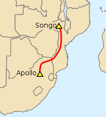]
-   thyristor ratings have grown up to $V=9$ kV and $I=4$ kA (per thyristor)
-   late ‘90s : high power *transistor*-based components become
    available : IGBT, MOSFET
-   development of *Voltage Source Converters*.
    Among other advantages, they allow controlling both the active and
    the reactive powers at the AC terminals of an HVDC link.

---

## First application : Power transmission over long distances

Long AC lines require reactive power compensation / voltage support and
for distances larger than 600-800 km, HVDC is more economical

Examples :

.grid[
.kol-1-2[
Pacific DC inter-tie along West coast of USA :
1360 km    3100 MW    $\pm$ 500 kV

Cahora-Bassa line in Mozambique :
1420 km    1920 MW    $\pm$ 533 kV

Hydro-Québec DC line :
1018 km    2000 MW    $\pm$ 450 kV
]
.kol-1-2[
.center.width-100[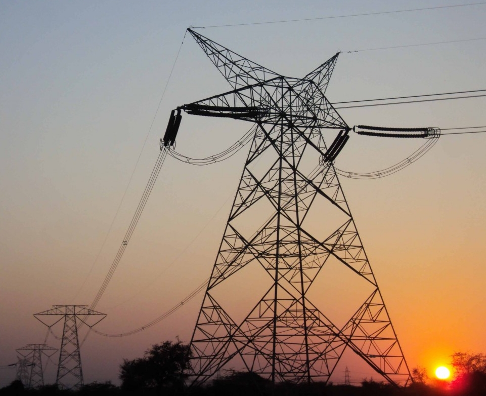]
]]

---

## Smaller investment costs

.grid[
.kol-1-2[
.center.width-100[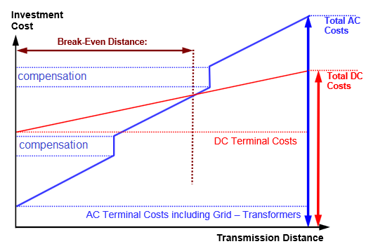]
]
.kol-1-2[
.center.width-100[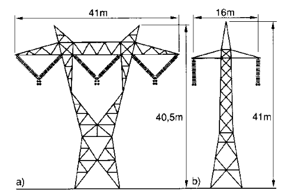]
]]

.grid[
.kol-1-2[
-   initial investment is higher for DC (due to converters) but

-   with increasing distance, reactive power compensation is required
    for an AC line

-   break-even distance 600-800 km
]
.kol-1-2[
-   comparison of towers : same transmission capacity of 3 GW, a) 735 kV
    AC   b) $\pm$ 500 kV DC

-   smaller Right-of-Way for DC corridor

-   reduced footprint
]]

---

## Lower losses, higher thermal capacity

.center.width-50[]

At a similar voltage level (RMS phase-to-phase vs. DC pole-to-ground) :

-   a DC line can transmit more than twice the power of an AC line

-   with about half the losses of an AC line.

---

## Second application : submarine power transmission

.grid[
.kol-1-2[
-   AC cables have large capacitance. Maximal acceptable length : 50-70
    km.
    - For larger distances, HVDC is the only (reasonable) solution

-   Examples from Europe :

    -   *NorNed* link between Norway and The Netherlands (2008)\
        580 km   700 MW   $\pm$ 450 kV (LCC type)

    -   *Nemo* link between Belgium and UK (2019)\
        140 km   1000 MW   $\pm$ 400 kV (VSC type)

    -   Connections of off-shore wind parks in North Sea to the
        continental European grid
]
.kol-1-2[.center.width-80[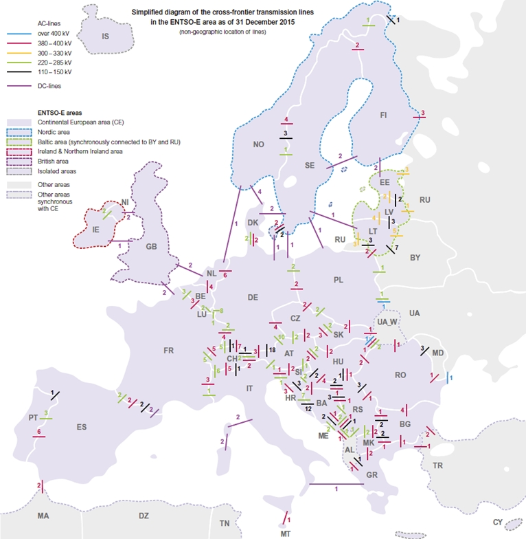]
.center[*Source ENTSOe (www.entsoe.eu)*]
]]

---

## Third application : DC link in AC grid, for power flow control

-   power flows in AC lines cannot be controlled directly

    -   determined by line impedances, obeying Ohm and Kirchhoff laws

    -   partially controllable by phase shifting transformers

-   power flows in HVDC links can be controlled directly (through the
    controllers of converters). This can be used :

    -   to limit “loop flows” and overloading of AC lines

    -   to make the link participate in energy tradings.

-   Examples :

    -   *ALEGrO* (Aachen Liège Electric Grid Overlay) project of
        HVDC link between Belgium and Germany (2020):
        100 km (49 in Belgium)   1000 MW   buried cable

    -   France - Spain DC interconnection :
        65 km   buried XLPE cable   $\pm$ 320 kV DC   2000 MW
---

## France - Spain DC interconnection

.grid[
.kol-1-2[
- Can reverse power flow in 150 milliseconds (!)
- Investment cost : 700 M€
]
.kol-1-2[
.center.width-80[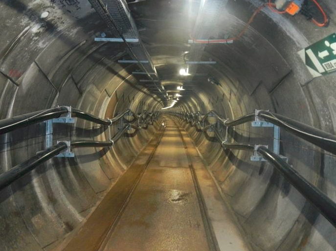]
]]
.grid[
.kol-1-2[
.center.width-80[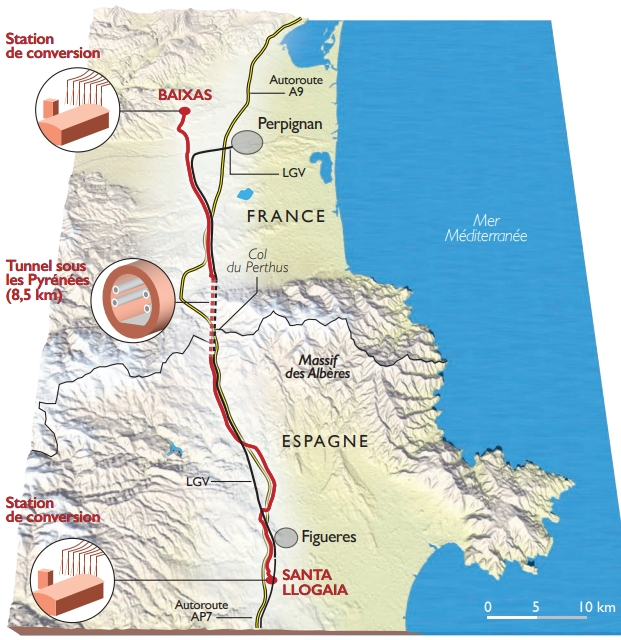]
]
.kol-1-2[
.center.width-60[]
]]

---

## Fourth application : interconnection of asynchronous AC systems

*Two AC networks with different nominal frequencies.*

Back-to-back connection (rectifier and inverter in same substation)

.grid[
.kol-1-2[
-   Melo HVDC link between Uruguay (50 Hz) and Brazil (60 Hz)  
    500 MW  $\pm$ 79kV
-   Shin Shinano HVDC link between Western (60 Hz) and Eastern (50 Hz) power grids of Japan  
    600 MW  $\pm$ 125 kV
]
.kol-1-2[
.center.width-80[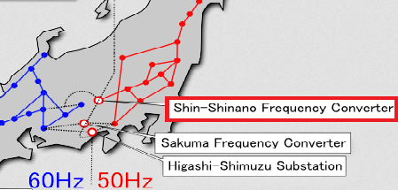]
]]

---

*Two AC networks with identical nominal frequency but different
    frequencies (not interconnected for size reasons)*

.grid[
.kol-1-2[
Highgate back-to-back HVDC link between Québec and Vermont 
    200 MW   $\pm$ 57 kV
.center.width-80[]
.center.width-80[]
]
.kol-1-2[
McNeil HVDC link between Alberta and Saskatchewan  
    150 MW   $\pm$ 42 kV
.center.width-80[]]]

---

## Fifth application : Multiterminal DC grids

*Radial* DC link with AC/DC converter(s) connected at intermediate points
.grid[
.kol-1-2[
.center.width-60[]
]
.kol-1-2[
A few systems are in operation today with proven technology
-   example : the Sardinia-Corsica-Italy link (SACOI)
3 terminals. The 2-terminal Italy-Sardinia link was initially built, and the Corsica terminal installed at a later stage
-   more elaborate control scheme than for a two-terminal link
]]
.grid[
.kol-1-2[
Another application : collect power from off-shore wind parks
        located along a DC link between two on-shore terminals
]
.kol-1-2[
.center.width-60[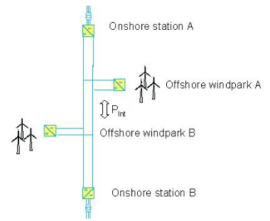]
]]

---

## Meshed DC grids

-   still at research level

-   typical targeted application : (i) collect power from off-shore
    wind parks, and (ii) allow power exchanges between on-shore
    grids

.center.width-50[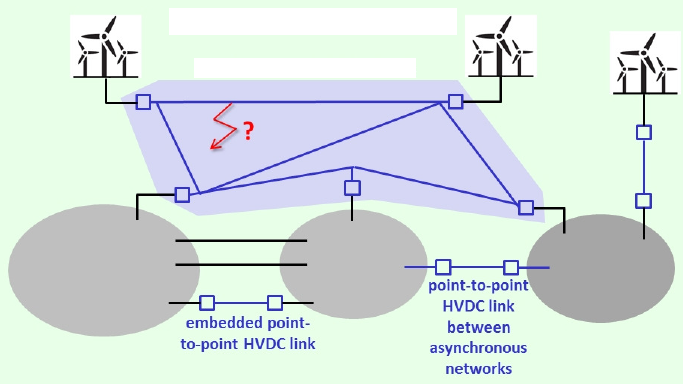]

-   main technological challenges :

    -   identification of faults in DC grid (to isolate only the
        faulted branch)

    -   DC circuit breaker to interrupt the DC fault current

---

## Two technologies

.grid[
.kol-1-2[
**Line Commuted Converters (LCC)**
-   large power ratings
-   large harmonics filters
-   requires a strong enough AC grid
-   active power is controlled
-   always consumes reactive power
-   cannot be used as off-shore terminal to collect wind power
-   cheaper (but VSC is a fast evolving technology)
-   less commutation losses than VSC
-   but possible commutation failure
]
.kol-1-2[
**Voltage Source Converters (VSC)**
-   lower power ratings (but fast growing technology)
-   less harmonic filters needed
-   can operate with a weak AC grid
-   active powers can be controlled
-   can be used as off-shore terminal to collect wind power
-   black start capability
]]

---

## LCC technology

.center.width-50[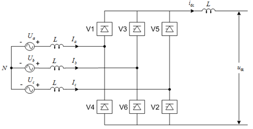]

-   based on thyristors, used as switches closed with delay
-   thyristor commutation synchronized with grid voltage
    (hence the term “line commutated”)
-   also referred to as “Current Source Converter” or “classic HVDC”
-   DC current cannot be reversed (due to thyristors).
    Hence, power is reversed by reversing the DC voltage polarity.

---

## VSC technology

Based on Insulated Gate Bipolar Transitors (IGBT), used as *self-commutating* switches

Two topologies :
.grid[
.kol-1-2[
.center.width-100[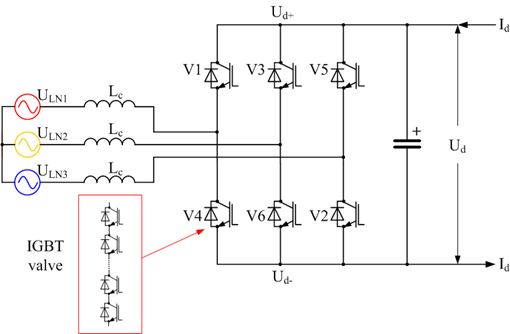]
    Pulse Width Modulation (PWM)
]
.kol-1-2[
.center.width-80[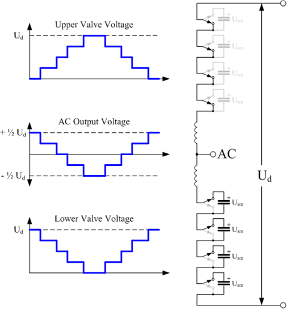]
    Modular Multilevel Converter (MMC)
]]
Power is reversed by reversing the current.

---

class: middle, center

# Components of an LCC HVDC link
Extract of chapter 1 of former course "ELEC0445 - HVDC grids".

---

## A typical LCC HVDC system

.center.width-100[]

---

## Converters

.center.width-100[]

-   one converter at each terminal : the sending power end acts as a
    rectifier, the receiving power end as an inverter
    -   each converter includes one or several thyristor *bridges*
    -   each bridge is made up of *6* thyristor *valves*
    -   each thyristor valve contains *hundreds of individual thyristors*

---

## Converter transformers

.center.width-100[]

-   most generally equipped with load tap changers. The transformer
    ratios are adjusted to optimize the HVDC link operation
-   designed to operate with high harmonic currents
    -   generally more expensive than typical transmission transformers of the same rating

---

## Smoothing reactors on the DC side

.center.width-100[]

-   aimed at limiting the DC current variations
    -   designed considering response to DC faults and commutation failures
    -   typical values of inductance : 0.1 to 0.5 H
    -   air-core, natural air cooling type

---

## Harmonic filters

.center.width-100[]

-   aimed at filtering the harmonics generated by the AC/DC conversion
    -   most important harmonics to eliminate : 11th, 13th, 23rd and 25th
        (for converters with two bridges)
    -   some HVDC systems are also equipped with filters on the DC side

---

## Reactive power compensation

.center.width-100[]

-   the converters consume reactive power (around 60% of power rating)
-   that reactive power varies with the active power level
-   a large part of the reactive compensation comes from the filter banks
-   the remaining part is supplied by switchable capacitor banks

---

## Control and communication systems

.center.width-100[]

-   each terminal has a control system with multiple hierarchical layers
    : control of resp. the DC current, the DC voltage, the thyristors, etc.
-   a dedicated communication link is needed between both terminals to
    optimize system operation

---

class: middle, center

# Thyristor valves
A summary of chapter 2 of former course "ELEC0445 - HVDC grids".

---

## The thyristor

-   Essential component of HVDC valves in the LCC technology
-   operates as a controllable diode
-   can have high power ratings : up to 8.5 kV, 4500 A capability
-   is robust and efficient.

Four-layer, three-terminal device.
.grid[
.kol-1-2[
Three $pn$ junctions $J_1$, $ J_2$, $J_3$
.center.width-100[]
]
.kol-1-2[
-   equivalent to two bipolar transistors
-   assume $V_{AK}>0$ and inject $I_G$
-   both transistors remain in saturation even if $I_G$ is suppressed
.center.width-70[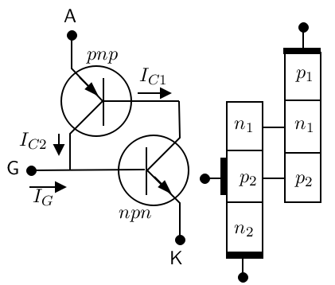]
]]

---

## Usage of a thyristor

A thyristor can be used as a controllable bistable switch
- the control is performed by injecting a current at the gate input
 - the thyristor is *ON* and conducts when it is forward biased and the gate receives a current pulse
 - the thyristor keeps on conducting as long as it is forward biased
 - the thyristor is turned *OFF* when the anode current falls below the holding current threshold IH or when it is reverse biased
 - the thyristor remains in blocking mode until it is triggered by a new gate pulse current
- the process of turning OFF is called commutation
 - when commutating, the thyristor cannot immediately withstand a forward voltage; it should remain reverse biased for a minimum time, otherwise *commutation failure* can take place.

---

## Modes of operation of the thyristor 

Three modes of operation depending on :
-   the sign of the anode $-$ cathode voltage $v_{AK}$
-   whether a current $I_G$ is injected at the gate terminal

A *reverse voltage $v_{AK}<0$* is applied.
-   Junction $J_2$ is in *forward* bias mode
-   junctions $J_1$ and $J_3$ are in *reverse* bias mode
-   the thyristor acts as a diode in reverse bias mode; it is in *off-state*
-   breakdown occurs when $v\_{AK}$ is more negative than the *reverse breakdown voltage*
    $V\_{BR}$. Most often this is associated with junction $J_1$
-   in HVDC applications, the breakdown mode must be avoided since
    it can lead to material destruction.
-   hence, thyristors with high $|V_{BR}|$ values must be used, and
    measures taken to limit the avalanche current.

---

## Modes of operation of the thyristor (...)

A *forward voltage $v_{AK}>0$* is applied 
-   Junctions $J_1$ and $J_3$ are *forward* in bias mode
-   junction $J_2$ is in *reverse* bias mode
-   the thyristor behaves as a diode in reverse bias mode; it is in *off-state*
-   breakdown occurs when $v_{AK}$ is larger than the forward breakdown voltage of junction $J_2$

.center.width-70[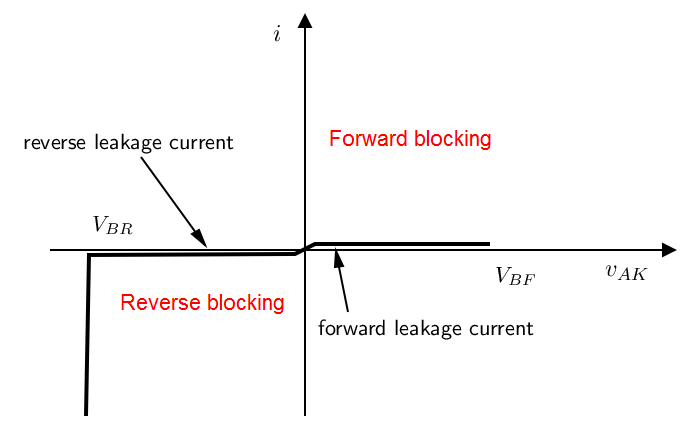]

---

## Modes of operation of the thyristor (...)

A *forward voltage $v_{AK}>0$* is applied and *a current $I\_g$ is injected*.
-   the current injection results in an avalanche process
-   “as if” layer $p_2$ would become of $n$-type. Hence, the
    thyristor behaves as a $pn$ diode in forward bias mode : it
    switches to *on-state*
-   the thyristor resistance is dramatically reduced (from
    $10^6 \, \Omega$ to $10^{-1}\, \Omega$)
-   the larger $I\_G$, the smaller the value of $v\_{AK}$ needed to
    initiate the avalanche.

---

## Operation of the thyristor in on-state

.center.width-60[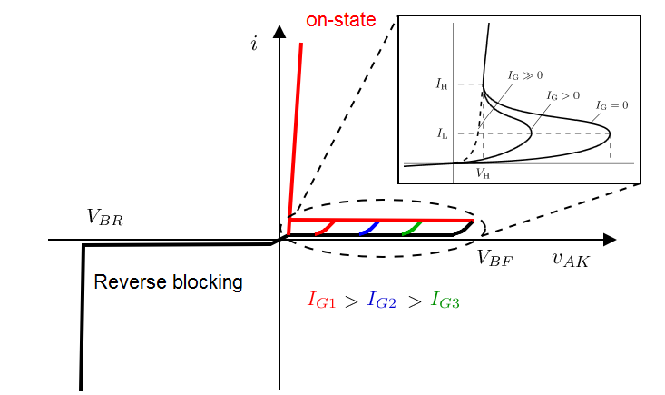]
-   once the anode current $i$ reaches $I_L$, the *latching curent*, the thyristor
    switches to on-state
-   once the thyristor is in on-state, the gate current can be removed
-   the gate current is usually a short pulse lasting 10-50 $\mu$s
-   if $i$ falls below $I_H$, the *holding curent*, the thyristor switches to off-state.
-   **commutation is not instantaneous** -> dynamics -> and care must be taken with applied currents and voltages -> snubber circuits

---

## The ideal characteristic

.grid[
.kol-1-2[
.center.width-100[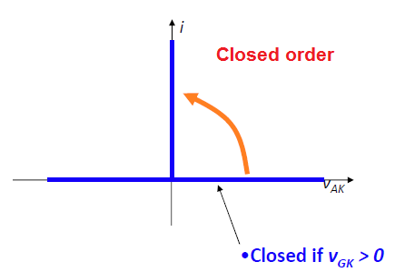]
]
.kol-1-2[
.center.width-100[]
]]

-   closed order given by gate current
-   in open state, $V\_{BR}$ and $V\_{BF}$ are assumed infinite
-   when the thyristor conducts, a zero internal resistance is assumed
-   when the thyristor conducts, a zero terminal voltage is assumed.

---

## Thyristor valves 

.grid[
.kol-1-2[
Thyristor modules (i.e. thyristor + snubber circuit + voltage balancing circuits) are associated in series to form a thyristor valve.
- Objective : reach the HVDC link
- voltage rating :
 - thyristor : up to 5 to 9 kV
 - HVDC link : 500 to 800 kV
]
.kol-1-2[
.center.width-80[]
A 2000A, 250 kV high voltage direct current (HVDC) thyristor valve at Manitoba Hydro's Henday converter station. Photo taken April 2001. Source: Wikipedia.
]]

---

## Switching characteristics

**From off-state to on-state**:

-   initially, the thyristor is forward biased ($v_{AK}>0$)
-   one pulse of $I_G$ initiates conduction
-   switching takes place during the (a few $\mu$s):
    -   the current increases
    -   the voltage decreases to about 0.5 - 2.5 V

.center.width-100[]

---

**From on-state to off-state**:

-   the thyristor turns off when $i$ falls below $I_H$ and reverses
-   recombinations of charge carriers take place in junctions $J_1$ and
    $J_3$, which switch to reverse bias mode
-   a maximum reverse current is observed and the voltage is reversed
-   an over-voltage can be observed if current extinction is too fast
-   once the charge carrier recombination is completed, $i$ goes to
    zero.

.center.width-100[]

---

class: middle, center

# Operation of the LCC line
A summary of chapter 3 of former course "ELEC0445 - High Voltage Direct Current grids".

---

## Diode based rectifier

.grid[  
.kol-1-2[.center.width-100[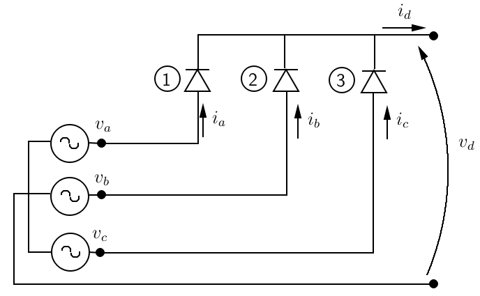]]
.kol-1-2[.center.width-100[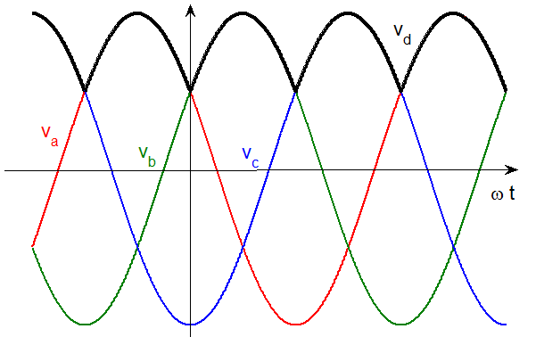]
.center.width-100[]]]

Without filtering, we already have a relatively good rectification.

---

To get a more constant current, we use smoothing reactors in series. 
The bigger $L\_d$, the more constant the current.

Hence we suppose $I\_d$ is constant, and the currents in the 3 phases on the AC side look like
.center.width-50[]

Note that in practice, as there are inductors in the system, currents cannot vary abruptly, and there is a *commutation overlap* (two of the three diodes conducting simultaneously), hence an angle $\mu$ and a voltage reduction.
We'll neglect this in the sequel (to keep it simple), but this is important in practice.

---

## The thyristor-based 6-pulse rectier with *no ignition delay*

In this case Thyristor = Diode (natural conduction)

.grid[
.kol-1-2[.center.width-100[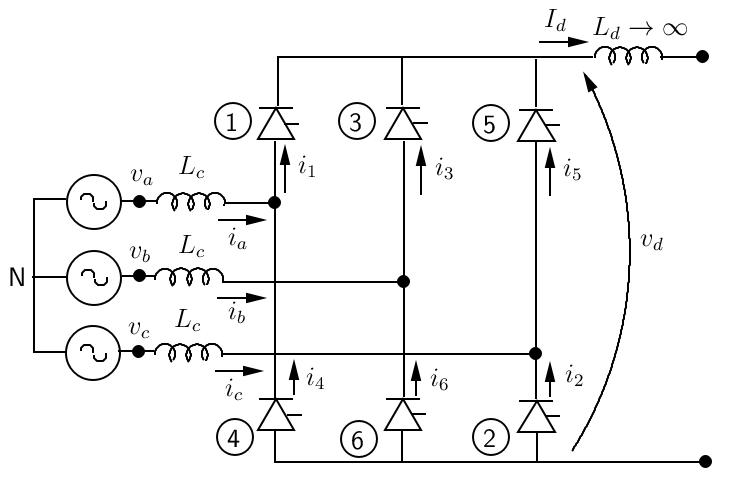]]
.kol-1-2[.center.width-100[]]]

Average direct voltage = integral of line voltage over a period of length $\pi/3$
$$V\_{d0} = \frac{3\sqrt{2}}{\pi} U = 1.35 U$$

---

class: middle, center, black-slide

<iframe width="600" height="450" src="https://www.youtube.com/embed/WVI8Z7p_rdY" frameborder="0" allowfullscreen></iframe>

6-pulse rectifier

---

## With an ignition delay $\alpha$

.center.width-70[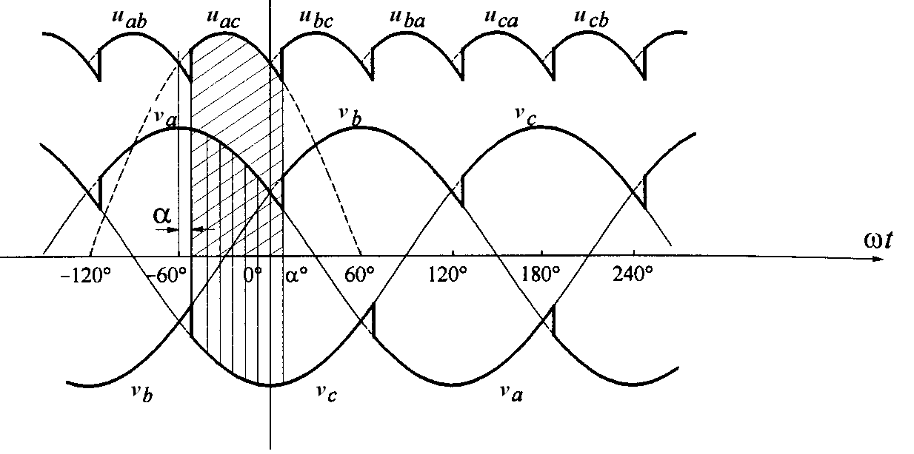]

.grid[
.kol-1-2[
The ignition can be delayed up to $\alpha=180^\circ$
 - for instance : switching from valve 1 to valve 3 is possible as long as $v\_a < v\_b$.
 - After that, valve 3 is in reverse blocking mode.
]
.kol-1-2[
.center.width-50[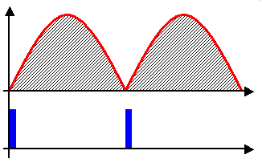]
Waveforms in a rectified multiple thyristor circuit controlling an AC current.
Red trace: load (output) voltage
Blue trace: trigger voltage. Source: Wikipidia (Thyristor)]
]]

---

## Average direct voltage and power factor

Average direct voltage: $$V\_{d} = V\_{d} \cos \alpha$$
- $V\_d$ may take values from $V\_{d0}$ down to $-V\_{d0}$
    -   positive values of $V\_d$ ($0 < \alpha < 90^{\circ}$) : rectifier operation.  Power flows from AC to DC since    $V\_d I\_d > 0$
    -   negative values of $V\_d$ ($90 < \alpha < 180^{\circ}$) : inverter operation.  Power flows from DC to AC since    $V\_d I\_d < 0$.

With accounting for commutation delays, it can be shown that 
$$\cos \phi = \cos \alpha$$

---

class: middle, center

# Control

---

## The HVDC link, its equivalent circuit and its voltage profile

.center.width-60[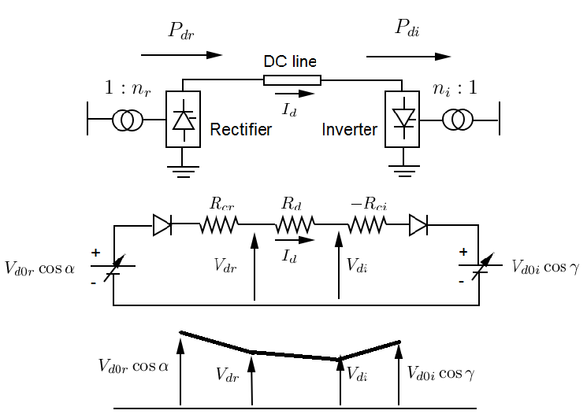]

Thus 
$$I\_d=\frac{V\_{d0r}\cos \alpha - V\_{d0i} \cos \gamma}{R\_{cr} + R\_d - R\_{ci}}$$
and 
$$P\_{dr} = V\_{dr}I\_d, \; \; P\_{di} = V\_{di}I\_d = P\_{dr} - R\_d I\_d^2$$

---

## Available controls 

.grid[
.kol-1-2[
We thus have  
$$ V\_{dr} = V\_{d0r} \cos \alpha - R\_{cr} I\_d $$
$$ V\_{di} = V\_{d0i} \cos \gamma - R\_{ci} I\_d $$ 
$$ V\_{dr} = V\_{di} + R\_d I\_d $$
and as established previously
$$V\_{d0r} = \frac{3 \sqrt{2}}{\pi} n\_r U\_r $$
$$V_{d0i} = \frac{3 \sqrt{2}}{\pi} n\_i U\_i$$
]
.kol-1-2[
Available controls are used in complementary manner :
-   the internal DC voltage   $V\_{d0r}\cos \alpha$   by adjusting the ignition angle $\alpha$
-   the internal DC voltage   $V\_{d0i}\cos \gamma$   by adjusting the extinction angle $\gamma$
-   the AC voltages of the converters through the transformer ratios $n\_r$ and $n\_i$.
]]

---

## Remarks

Attention must be paid to :
-   avoiding too low a current $I\_d$ (unstable commutation)
-   avoiding too high a current $I\_d$ (overload of valves) 
-   having a stable HVDC link operation in spite of variations of AC voltages.

The power $P\_{dr}$ (or $P\_{di}$) can be controlled instead of the current $I\_d$.

---

## Control principle

Overall principle :

-   the regulations of resp. $V\_d$ and $I\_d$ are performed by the terminals separately
-   this does not require fast exchange of information between both
    terminals
    -   only when the respective roles of the rectifier and the inverter change
-   Under normal operation :
    -   the rectifier maintains a Constant Current (CC) $I_d$ mode
    -   the inverter maintains Constant Extinction Angle (CEA) $\gamma$ mode.

---

## Ideal steady-state $V-I$ characteristics:

.center.width-60[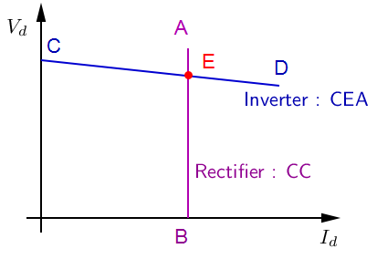]

- Rectifier characteristic : $I\_d = $ constant
- Inverter characteristic : from previous equations
  $$V\_{dr}=V\_{d0i}\cos \gamma +(R\_d -R\_{ci})I\_d$$
  generally, $R\_{ci}$ is slightly larger than $R\_{d}$ and the characteristic has a small negative slope
- Operating state : point **E** at the intersection of the two characteristics

---

class: middle

# HVDC in the power flow analysis

---

## A simple implementation in panda power for point to point HVDC

From https://pandapower.readthedocs.io/en/v2.4.0/elements/dcline.html:

.grid[
.kol-1-2[
A DC line is modelled as two generators in the loadflow:   
.center.width-100[] 
.center.width-100[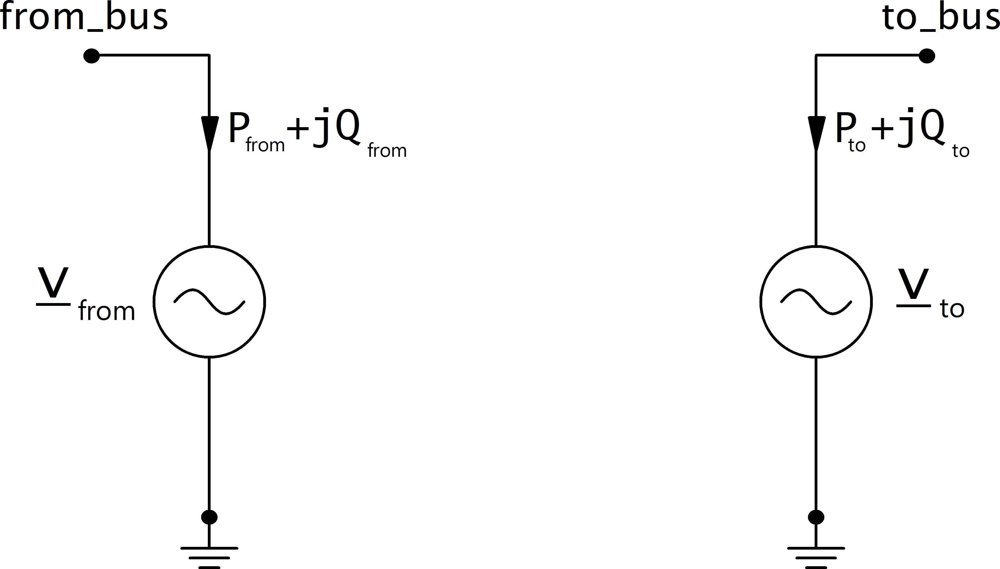]
]
.kol-1-2[
- The active power at the from side is defined by the parameters in the dcline table. 
- The active power at the to side is equal to the active power on the from side minus the losses of the DC line.
- The voltage control with reactive power works just as described for the generator model. Maximum and Minimum reactive power limits are considered in the OPF, and in the PF if it is run with enforce_q_lims=True.
]]

---

## More advanced implementation (OPF setting)

Hotz, M., & Utschick, W. (2019). hynet: An optimal power flow framework for hybrid AC/DC power systems. IEEE Transactions on Power Systems, 35(2), 1036-1047.

"While the modeling of DC grids, where DC lines and cables are considered via their equivalent series resistance, resembles that of AC grids and is rather straightforward, the modeling of VSCs is more intricate. Elaborate models for VSC stations comprise a transformer, filter, phase reactor, and converter. While the former three can be considered via equivalent $\pi$-models, the converter is modeled as a lossy transfer of active power between the AC and DC side of the converter with the provision of reactive power on the AC side (...). Many recent works model the converter losses as a quadratic function of the converter current (...) In terms of operating limits, the most elaborate characterizations include a converter current limit as well as constraints that restrict the provision of reactive power based on the coupling of the AC- and DC-side voltage (...). As a consequence of the significant increase in model complexity compared to AC systems, the mathematical formulation and parameterization of the OPF problem for hybrid AC/DC power systems is intricate and extensive."

---

## Other implementations examples

Braunagel, Kraft, Whysong - 1976 - Inclusion of DC converter and transmission equations directly in a newton power flow.

Bondhala, U., & Sarkar, V. (2011). Power Flow Studies of an AC-DC Transmission System (Doctoral dissertation, Indian Institute of Technology Hyderabad).

---

## Example with Pandapower

See the python notebook

---

# References

- Mohan, Ned. Electric power systems: a first course. John Wiley & Sons, 2012.
- [Course notes of ELEC0445](https://people.montefiore.uliege.be/vct/courses.html) by Pr. Thierry Van Cutsem and al.
- L. Thurner, A. Scheidler, F. Schäfer et al, pandapower - an Open Source Python Tool for Convenient Modeling, Analysis and Optimization of Electric Power Systems, in IEEE Transactions on Power Systems, vol. 33, no. 6, pp. 6510-6521, Nov. 2018.

---

class: end-slide, center
count: false

The end.
