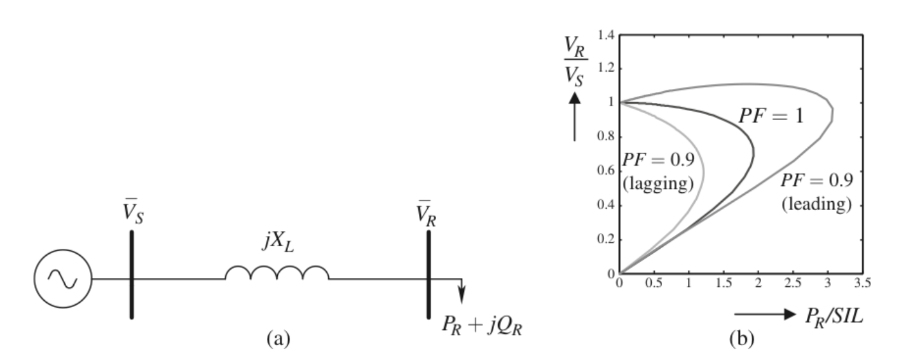
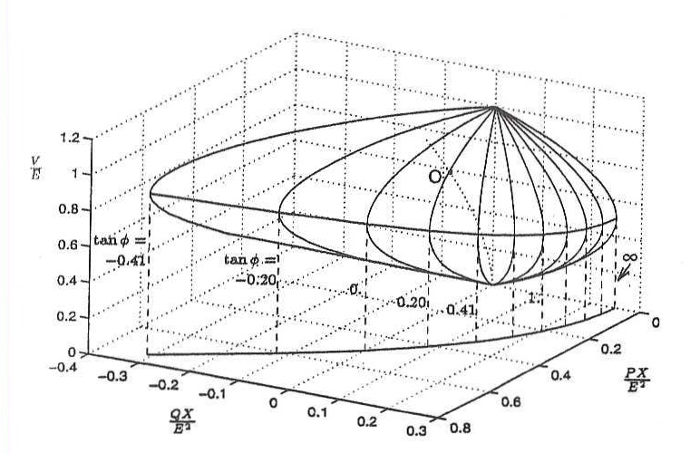
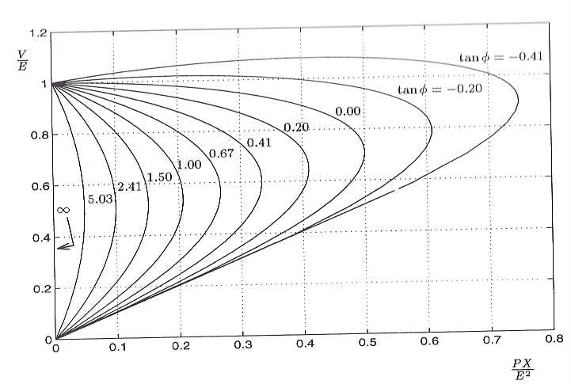
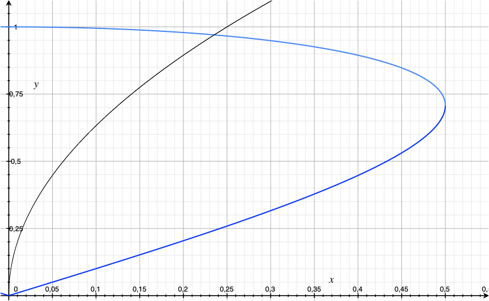
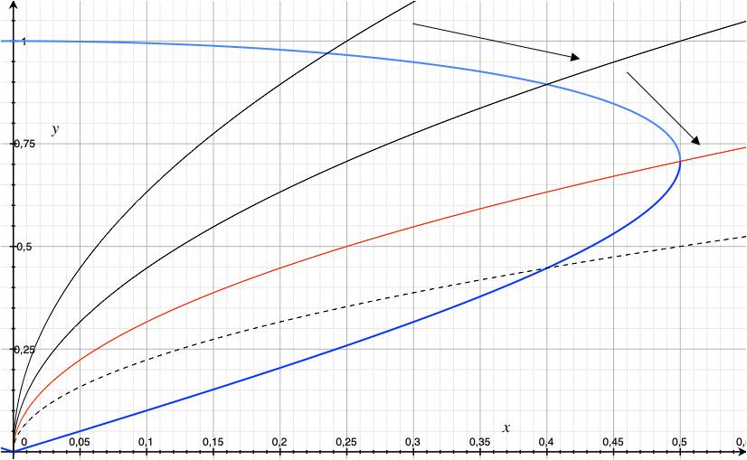
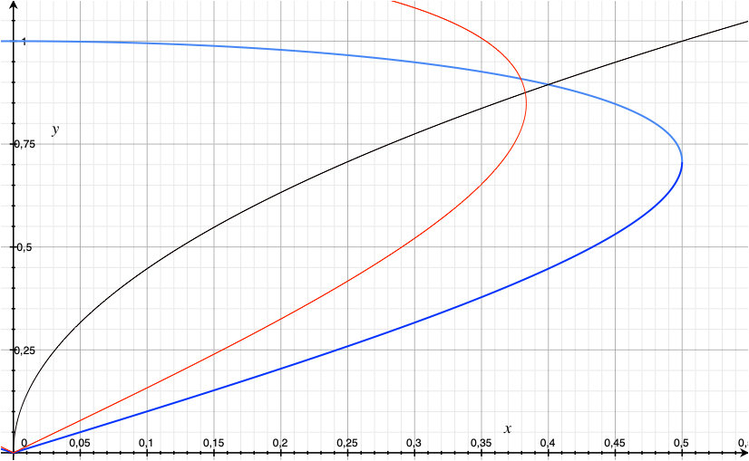
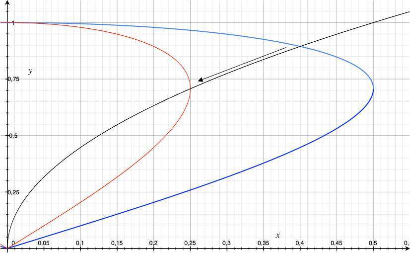
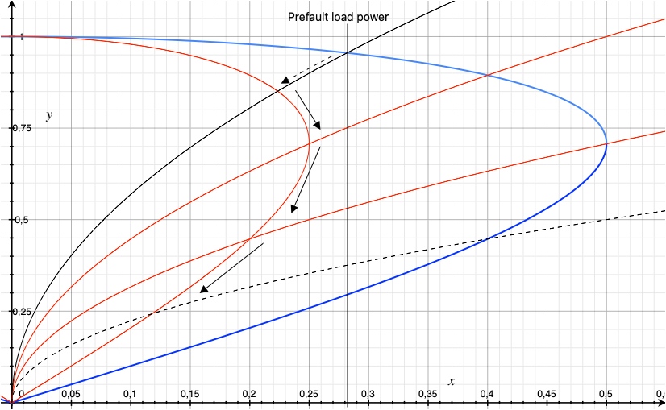
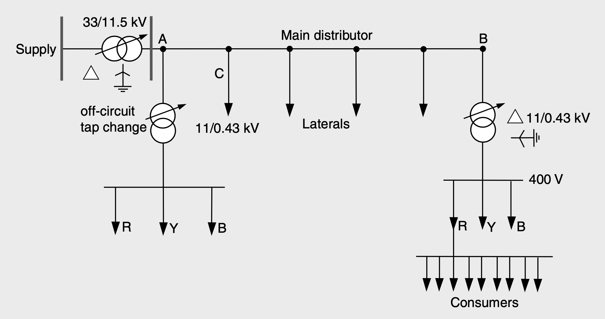
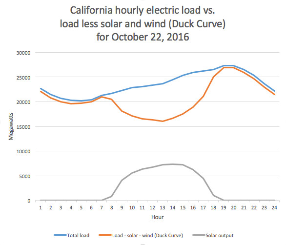

class: middle, center, title-slide
count: false

<!--

python3 -m http.server 8001

decktape http://0.0.0.0:8001/?p=lecture7.md pdf/lecture7.pdf

http://0.0.0.0:8001/?p=lecture7.md#1
-->

# Analysis of electric power and energy systems

Lecture 7: Voltage regulation and voltage instability

  

Louis Wehenkel 
[L.Wehenkel@uliege.be](mailto:L.Wehenkel@uliege.be)

---

# What will we learn today?

- Voltage regulation and reactive power compensation in EHV grids 
- Voltage instability and voltage collapse
- EHV Voltage control and reactive power compensation devices
- Voltage control in the distribution systems
- Likely impact of the energy transition on these topics

***
**This lecture expands on Chapter 10 from the Ned Mohan's book.**

---
class: middle

# Voltage regulation and reactive power compensation in EHV grids 

---
## Radial system as an example

We want to transfer some active power $P_R$ to a load through an 
EHV-line

.center[.width-95[]]

Neglecting line resistance $R_L$, we have ${\bar{V}_S = \bar{V}_R}+ {j X_L}\bar{I}$ and hence
$$P_R = \frac{V_R V_S }{X_L}\sin \delta  = P_S$$  $$Q_R = \frac{V_R}{X_L}(V_S\cos \delta - V_R)$$

where $\delta$ is the angle of the source (generator) bus w.r.t. the receiving
(load) bus.
<!-- = Y \angle \phi_y = Y e^{j \phi_y}$$ Y \angle \phi_y = Y e^{j -->
<!-- \phi_y}$$ -->

***

*Notice that in EHV (transmission systems) at 100kV-750kV: $X_L/R_L \approx
10-30$.*

---

## Voltage regulation

In practice we also want the voltage magnitude at both ends to be
close to $1$ pu.

.center[.width-95[]]

We see that under these conditions $Q_S$​ is positive and $Q_R$​ is
negative and, assuming $V_R=V_S=1$, we have $$Q_S = -Q_R = \frac{X_L I^2}{2}$$

Part of this reactive power is already produced by the capacitance of the line itself.

The rest, depending on the
amount of power $P_R$​ transfered to the load,  has to be compensated for at both ends.

---

## Voltage profile along the line

The voltage profile $V_x$ along the line depends on the amount of
power transfered $P_R$, in comparison with the surge
impendance loading (SIL) of the line:

.center[.width-95[]]

If $P_R> SIL$, the line consumes more reactive power than it produces,
and we have to supply $Q'_S>0$ and $Q'_R < 0$ at both ends. In these
conditions, the voltage profile along the line will be $V_x<V_S$.​

If $P_R < SIL$, the line produces reactive power and we have to absorb the surplus 
at its ends. The voltage profile
along the line will be $V_x>V_S$. 

In this latter case (e.g. cables, or very long transmission lines), the insulation capability may impose reactive
power compensation 'along' the line, e.g. in the form of shunt reactors. 

---
class: middle

# Voltage instability and the voltage collapse problem

---

## The $(P_R,V_R)$ curve (aka 'nose or PV curve')

Consider the case of Figure (a) below, assuming an ideal voltage
source and neglecting line resistance and line capacitance:

.center[.width-95[]]

From Figure (b) above, we see that  (for each PF) there is a maximum value of $P_R$ that can
be transfered to the load. Below this maximum of $P_R$, there are two possible modes
of operation

- the high voltage solution, which is stable

- the low voltage solution, which is unstable

<!-- Feeding a load through a transmission line: see Fig. 10.4
- Students have to simulate step by step increase of load, by using the load-flow
engine to construct PV curve (for different LFs)
- For two load levels, simulate line outage assuming that it
  translates in a sudden multiplication by 2 of $X_L$ and that load is
  an impedance
- Discuss load-restoration process and its impact -->

---
## The $(P_R,Q_R,V_R)$ surface 

.center[.width-95[]]

##### Figure from: Voltage stability of electric power systems. T. Van Cutsem & C. Vournas, KAP 1998

NB: in our notations: $E \equiv V_S, V \equiv V_R, X \equiv X_L, P \equiv P_R, Q
\equiv Q_R$

---

.center[.width-95[]]

##### Figure from: Voltage stability of electric power systems. T. Van Cutsem & C. Vournas, KAP 1998

NB: in our notations: $E \equiv V_S, V \equiv V_R, X \equiv X_L, P \equiv P_R, Q
\equiv Q_R$

---

## Assume a purely resistive load, i.e. PF=1 (i.e. $\tan \phi = 0$)

Setting $y = \frac{V_R}{V_S}$ and $x = \frac{P_R X_L}{V_S^2}$, the
(blue) nose curve is  $y= \sqrt{\frac{1}{2}
\pm \sqrt{\frac{1}{4} - x^2}}$

.center[.width-75[]]

The load chacteristic (black curve) is defined by $P_R = \frac{V_R^2}{R_R}$, i.e. $y =\sqrt{x \frac{R_R}{X_L}}$

The operating point is obtained as the
intersection of the nose curve and the load characteristic.

---

## Voltage instability mechanism 1: increasing the load level

Increasing the load essentially consists in adding further loads in
parallel with already existings ones, and thus results in a decrease of the
total load resistance.

.center[.width-75[]]

The red curve corresponds to $R_R = X_L$, $V_R =
V_S / \sqrt{2}$ and $P_R = V_S^2 / (2 X_L)$.

Beyond this level, further decreasing the load resistance $R_R$
actually decreases the load power $P_R$ and voltage $V_R$ starts
to drop, more and more quickly.

---

## Voltage instability mechanism 2: reactive power limit of generators

We the load power increases, the source generator must supply more and
more reactive power.

.center[.width-75[]]

The red "PV-curve" corresponds to the source generator reaching its
excitation current limit: the ideal voltage source is replaced by adding its
synchronous reactance in series with the line.

---

## Voltage instability mechanism 3: line tripping

Imagine that $X_L$ represents the equivalent reactance of a double
circuit EHV line, and that one of the two-circuits suddenly trips 
out of operation: the equivalent line reactance becomes $2 X_L$ (red
nose curve).

.center[.width-75[]]

The operating point "instantaneously" switches to the intersection of
the load characteristic and the new system characteristic, leading to
a significant drop in voltage and received power.

---

## Voltage instability mechanism 4: load restoration

.center[.width-75[]]

After the "instantaneous" (dashed arrow) switch of the operating
point, the load power has well decreased.

Subsequently, the load active power tries to restore itself to the level at which
it was before the line tripping (plain arrows).

This restoration process can yield voltage collapse as shown on the
graph. Its speed depends on the nature of the load restoration
process.

---

## Load power restoration mechanisms

- *Fast* (less than a minute): automatic controls acting on electric
  loads, such as speed control of 
  trains, elevators, and in general motors

- *Medium speed* (a few minutes): automatic controls of transformer
  ratios (taps) acting on the voltage level in the
  distribution system (since most loads are voltage sensitive)

- *Slow* (tens of minutes): thermostatic loads, manual 'human-driven' feedback
mechanisms

***

*NB: in practice, the various voltage instability and load-restoration
mechanisms may act in combination.*

***

*NB-bis: although we made a 2-bus analysis, the same phenomena are
observed in multi-bus systems.*

***

*NB-ter: voltage instability has led to several large-scale power
 system blackouts.*

***

---

## Systemic threats to voltage stability

- Increasing the distance ($X_L$) between supply and demand

- Reducing the reactive power generation reserves

- Faster load restoration mechanisms, slower reactive power controls

## Counter-measures

- Switchable reactive power compensation devices (capacitors, inductors) 

- Ensuring the availability of reactive power reserves close to load areas

- Ad hoc and clever voltage
  control schemes

---

class: middle

# Voltage control 

---

## Control devices (see section 10.4 of reference book)

- Voltage controls of synchronous generators and synchronous
  condensers
- Switching of reactive compensation devices (capacitors and inductors)
- Power electronics empowered devices: SVC, STATCOM, HVDC, TCSC

## Control strategies and methods

- Preventive control
<ul>
<li>Must-run generators (days/hours ahead in time)</li>
<li>Setting of control device parameters (weeks/months ahead in time)</li>
<li>Installation of reactive compensation devices (months/years ahead
in time)</li>
</ul>
- Corrective control
<ul>
<li>Primary/Secondary/Tertiary voltage control</li>
<li>Fast backup generation unit start-up</li>
</ul>
- Emergency control
<ul>
<li>On-load transformer tap changer blocking</li>
<li>Under voltage load-shedding</li>
</ul>

---

class: middle

# Voltage control in distribution networks

---

Distribution systems are (typically) radial, operate at lower voltage levels, and
have no synchronous generation installed.

Voltage is mostly controlled by using tap-changing transformers. Wires
copper sections are chosen in order to cover peak demand along the feeder.

.center[.width-75[]]

##### Figure from: Electric power systems, Weedy, B.M. et al. John Wiley & Sons, 2012

***

*Notice that in MV-LV (distribution systems) at 200V-20kV:
$X_L/R_L \approx 0.2 - 1$*

---

class: middle

# Likely impact of the energy transition

---

## A think tank

- Increasing difficulties
 - Fewer synchronous generators in operation at the transmission level
 - More and more pronounced 'Duck'-curve
.center[.width-45[]]

 - Higher variability of flows and flow-directions at the distribution
  and transmission level
- New 'high-tech' opportunities
<ul>
<li> Power electronics </li>
<li> Smart-grid technologies </li>
</ul>

---

# References

- Mohan, Ned. Electric power systems: a first course. John Wiley & Sons, 2012.
- Van Cutsem, Thierry and Vournas, Costas. Voltage stability of
electric power systems. Kluwer Academic Publishers, 1998
- Weedy, B.M. et al. Electric power systems. John Wiley & Sons, 2012

---

class: end-slide, center
count: false

The end.

